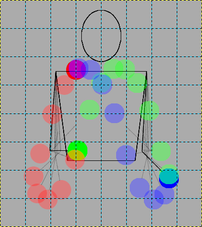

# Juggle Sprites

---

Regex Search: W|R|S|T|G|H|I|B|C|D

---

## Pattern

            [
                K, K, K, W, W, K, K, K,
                K, K, W, W, W, W, K, K,
                K, K, W, K, K, W, K, K,
                K, W, K, W, W, K, W, K,
                K, W, K, W, W, K, W, K,
                W, K, W, K, K, W, K, W,
                W, K, W, K, K, W, K, W,
                K, W, K, K, K, K, W, K
            ]

---

## 3-ball cascade (with white pattern)
            [
                K, K, K, W, W, K, K, K,
                K, K, W, W, W, W, K, K,
                K, K, R, K, K, W, K, K,
                K, W, K, W, W, K, W, K,
                K, W, K, W, W, K, W, K,
                W, K, G, K, K, W, K, W,
                W, K, W, K, K, W, K, B,
                K, W, K, K, K, K, W, K
            ], [
                K, K, K, W, W, K, K, K,
                K, K, W, W, W, W, K, K,
                K, K, S, K, K, W, K, K,
                K, R, K, W, W, K, W, K,
                K, W, K, G, W, K, W, K,
                W, K, H, K, K, W, K, W,
                W, K, W, K, K, W, K, C,
                K, W, K, K, K, K, B, K
            ], [
                K, K, K, W, W, K, K, K,
                K, K, W, W, W, W, K, K,
                K, K, T, K, K, W, K, K,
                K, S, K, G, W, K, W, K,
                K, R, K, H, W, K, W, K,
                W, K, I, K, K, W, K, W,
                W, K, W, K, K, B, K, D,
                K, W, K, K, K, K, C, K
            ], [
                K, K, K, W, W, K, K, K,
                K, K, W, W, G, W, K, K,
                K, K, W, K, K, W, K, K,
                K, T, K, H, W, K, W, K,
                K, S, K, I, W, K, W, K,
                R, K, W, K, K, B, K, W,
                W, K, W, K, K, C, K, W,
                K, W, K, K, K, K, D, K
            ], [
                K, K, K, W, G, K, K, K,
                K, K, W, W, H, W, K, K,
                K, K, W, K, K, W, K, K,
                K, W, K, I, W, K, W, K,
                K, T, K, W, B, K, W, K,
                S, K, W, K, K, C, K, W,
                R, K, W, K, K, D, K, W,
                K, W, K, K, K, K, W, K
            ], [
                K, K, K, W, H, K, K, K,
                K, K, W, W, I, G, K, K,
                K, K, W, K, K, W, K, K,
                K, W, K, W, B, K, W, K,
                K, W, K, W, C, K, W, K,
                T, K, W, K, K, D, K, W,
                S, K, W, K, K, W, K, W,
                K, R, K, K, K, K, W, K
            ], [
                K, K, K, W, I, K, K, K,
                K, K, W, B, W, H, K, K,
                K, K, W, K, K, G, K, K,
                K, W, K, W, C, K, W, K,
                K, W, K, W, D, K, W, K,
                W, K, W, K, K, W, K, W,
                T, K, R, K, K, W, K, W,
                K, S, K, K, K, K, W, K
            ], [
                K, K, K, B, W, K, K, K,
                K, K, W, C, W, I, K, K,
                K, K, W, K, K, H, K, K,
                K, W, K, W, D, K, G, K,
                K, W, K, W, W, K, W, K,
                W, K, R, K, K, W, K, W,
                W, K, S, K, K, W, K, W,
                K, T, K, K, K, K, W, K
            ], [
                K, K, K, C, W, K, K, K,
                K, K, B, D, W, W, K, K,
                K, K, W, K, K, I, K, K,
                K, W, K, W, W, K, H, K,
                K, W, K, R, W, K, G, K,
                W, K, S, K, K, W, K, W,
                W, K, T, K, K, W, K, W,
                K, W, K, K, K, K, W, K
            ], [
                K, K, K, D, W, K, K, K,
                K, K, C, W, W, W, K, K,
                K, K, B, K, K, W, K, K,
                K, W, K, R, W, K, I, K,
                K, W, K, S, W, K, H, K,
                W, K, T, K, K, W, K, G,
                W, K, W, K, K, W, K, W,
                K, W, K, K, K, K, W, K
            ], [
                K, K, K, W, W, K, K, K,
                K, K, D, W, R, W, K, K,
                K, K, C, K, K, W, K, K,
                K, B, K, S, W, K, W, K,
                K, W, K, T, W, K, I, K,
                W, K, W, K, K, W, K, H,
                W, K, W, K, K, W, K, G,
                K, W, K, K, K, K, W, K
            ], [
                K, K, K, W, R, K, K, K,
                K, K, W, W, S, W, K, K,
                K, K, D, K, K, W, K, K,
                K, C, K, T, W, K, W, K,
                K, B, K, W, W, K, W, K,
                W, K, W, K, K, W, K, I,
                W, K, W, K, K, W, K, H,
                K, W, K, K, K, K, G, K
            ], [
                K, K, K, W, S, K, K, K,
                K, K, W, W, T, R, K, K,
                K, K, W, K, K, W, K, K,
                K, D, K, W, W, K, W, K,
                K, C, K, W, W, K, W, K,
                B, K, W, K, K, W, K, W,
                W, K, W, K, K, G, K, I,
                K, W, K, K, K, K, H, K
            ], [
                K, K, K, W, T, K, K, K,
                K, K, W, W, W, S, K, K,
                K, K, W, K, K, R, K, K,
                K, W, K, W, W, K, W, K,
                K, D, K, W, W, K, W, K,
                C, K, W, K, K, G, K, W,
                B, K, W, K, K, H, K, W,
                K, W, K, K, K, K, I, K
            ], [
                K, K, K, W, W, K, K, K,
                K, K, W, W, W, T, K, K,
                K, K, W, K, K, S, K, K,
                K, W, K, W, W, K, R, K,
                K, W, K, W, G, K, W, K,
                D, K, W, K, K, H, K, W,
                C, K, W, K, K, I, K, W,
                K, B, K, K, K, K, W, K
            ], [
                K, K, K, W, W, K, K, K,
                K, K, W, W, W, W, K, K,
                K, K, W, K, K, T, K, K,
                K, W, K, W, G, K, S, K,
                K, W, K, W, H, K, R, K,
                W, K, W, K, K, I, K, W,
                D, K, B, K, K, W, K, W,
                K, C, K, K, K, K, W, K
            ], [
                K, K, K, W, W, K, K, K,
                K, K, W, G, W, W, K, K,
                K, K, W, K, K, W, K, K,
                K, W, K, W, H, K, T, K,
                K, W, K, W, I, K, S, K,
                W, K, B, K, K, W, K, R,
                W, K, C, K, K, W, K, W,
                K, D, K, K, K, K, W, K
            ], [
                K, K, K, G, W, K, K, K,
                K, K, W, H, W, W, K, K,
                K, K, W, K, K, W, K, K,
                K, W, K, W, I, K, W, K,
                K, W, K, B, W, K, T, K,
                W, K, C, K, K, W, K, S,
                W, K, D, K, K, W, K, R,
                K, W, K, K, K, K, W, K
            ], [
                K, K, K, H, W, K, K, K,
                K, K, G, I, W, W, K, K,
                K, K, W, K, K, W, K, K,
                K, W, K, B, W, K, W, K,
                K, W, K, C, W, K, W, K,
                W, K, D, K, K, W, K, T,
                W, K, W, K, K, W, K, S,
                K, W, K, K, K, K, R, K
            ], [
                K, K, K, I, W, K, K, K,
                K, K, H, W, B, W, K, K,
                K, K, G, K, K, W, K, K,
                K, W, K, C, W, K, W, K,
                K, W, K, D, W, K, W, K,
                W, K, W, K, K, W, K, W,
                W, K, W, K, K, R, K, T,
                K, W, K, K, K, K, S, K
            ], [
                K, K, K, W, B, K, K, K,
                K, K, I, W, C, W, K, K,
                K, K, H, K, K, W, K, K,
                K, G, K, D, W, K, W, K,
                K, W, K, W, W, K, W, K,
                W, K, W, K, K, R, K, W,
                W, K, W, K, K, S, K, W,
                K, W, K, K, K, K, T, K
            ], [
                K, K, K, W, C, K, K, K,
                K, K, W, W, D, B, K, K,
                K, K, I, K, K, W, K, K,
                K, H, K, W, W, K, W, K,
                K, G, K, W, R, K, W, K,
                W, K, W, K, K, S, K, W,
                W, K, W, K, K, T, K, W,
                K, W, K, K, K, K, W, K
            ], [
                K, K, K, W, D, K, K, K,
                K, K, W, W, W, C, K, K,
                K, K, W, K, K, B, K, K,
                K, I, K, W, R, K, W, K,
                K, H, K, W, S, K, W, K,
                G, K, W, K, K, T, K, W,
                W, K, W, K, K, W, K, W,
                K, W, K, K, K, K, W, K
            ], [
                K, K, K, W, W, K, K, K,
                K, K, W, R, W, D, K, K,
                K, K, W, K, K, C, K, K,
                K, W, K, W, S, K, B, K,
                K, I, K, W, T, K, W, K,
                H, K, W, K, K, W, K, W,
                G, K, W, K, K, W, K, W,
                K, W, K, K, K, K, W, K
            ], [
                K, K, K, R, W, K, K, K,
                K, K, W, S, W, W, K, K,
                K, K, W, K, K, D, K, K,
                K, W, K, W, T, K, C, K,
                K, W, K, W, W, K, B, K,
                I, K, W, K, K, W, K, W,
                H, K, W, K, K, W, K, W,
                K, G, K, K, K, K, W, K
            ], [
                K, K, K, S, W, K, K, K,
                K, K, R, T, W, W, K, K,
                K, K, W, K, K, W, K, K,
                K, W, K, W, W, K, D, K,
                K, W, K, W, W, K, C, K,
                W, K, W, K, K, W, K, B,
                I, K, G, K, K, W, K, W,
                K, H, K, K, K, K, W, K
            ]

---

## 3-ball cascade (without white pattern)

            [
                K, K, K, K, K, K, K, K,
                K, K, K, K, K, K, K, K,
                K, K, R, K, K, K, K, K,
                K, K, K, K, K, K, K, K,
                K, K, K, K, K, K, K, K,
                K, K, G, K, K, K, K, K,
                K, K, K, K, K, K, K, B,
                K, K, K, K, K, K, K, K
            ], [
                K, K, K, K, K, K, K, K,
                K, K, K, K, K, K, K, K,
                K, K, S, K, K, K, K, K,
                K, R, K, K, K, K, K, K,
                K, K, K, G, K, K, K, K,
                K, K, H, K, K, K, K, K,
                K, K, K, K, K, K, K, C,
                K, K, K, K, K, K, B, K
            ], [
                K, K, K, K, K, K, K, K,
                K, K, K, K, K, K, K, K,
                K, K, T, K, K, K, K, K,
                K, S, K, G, K, K, K, K,
                K, R, K, H, K, K, K, K,
                K, K, I, K, K, K, K, K,
                K, K, K, K, K, B, K, D,
                K, K, K, K, K, K, C, K
            ], [
                K, K, K, K, K, K, K, K,
                K, K, K, K, G, K, K, K,
                K, K, K, K, K, K, K, K,
                K, T, K, H, K, K, K, K,
                K, S, K, I, K, K, K, K,
                R, K, K, K, K, B, K, K,
                K, K, K, K, K, C, K, K,
                K, K, K, K, K, K, D, K
            ], [
                K, K, K, K, G, K, K, K,
                K, K, K, K, H, K, K, K,
                K, K, K, K, K, K, K, K,
                K, K, K, I, K, K, K, K,
                K, T, K, K, B, K, K, K,
                S, K, K, K, K, C, K, K,
                R, K, K, K, K, D, K, K,
                K, K, K, K, K, K, K, K
            ], [
                K, K, K, K, H, K, K, K,
                K, K, K, K, I, G, K, K,
                K, K, K, K, K, K, K, K,
                K, K, K, K, B, K, K, K,
                K, K, K, K, C, K, K, K,
                T, K, K, K, K, D, K, K,
                S, K, K, K, K, K, K, K,
                K, R, K, K, K, K, K, K
            ], [
                K, K, K, K, I, K, K, K,
                K, K, K, B, K, H, K, K,
                K, K, K, K, K, G, K, K,
                K, K, K, K, C, K, K, K,
                K, K, K, K, D, K, K, K,
                K, K, K, K, K, K, K, K,
                T, K, R, K, K, K, K, K,
                K, S, K, K, K, K, K, K
            ], [
                K, K, K, B, K, K, K, K,
                K, K, K, C, K, I, K, K,
                K, K, K, K, K, H, K, K,
                K, K, K, K, D, K, G, K,
                K, K, K, K, K, K, K, K,
                K, K, R, K, K, K, K, K,
                K, K, S, K, K, K, K, K,
                K, T, K, K, K, K, K, K
            ], [
                K, K, K, C, K, K, K, K,
                K, K, B, D, K, K, K, K,
                K, K, K, K, K, I, K, K,
                K, K, K, K, K, K, H, K,
                K, K, K, R, K, K, G, K,
                K, K, S, K, K, K, K, K,
                K, K, T, K, K, K, K, K,
                K, K, K, K, K, K, K, K
            ], [
                K, K, K, D, K, K, K, K,
                K, K, C, K, K, K, K, K,
                K, K, B, K, K, K, K, K,
                K, K, K, R, K, K, I, K,
                K, K, K, S, K, K, H, K,
                K, K, T, K, K, K, K, G,
                K, K, K, K, K, K, K, K,
                K, K, K, K, K, K, K, K
            ], [
                K, K, K, K, K, K, K, K,
                K, K, D, K, R, K, K, K,
                K, K, C, K, K, K, K, K,
                K, B, K, S, K, K, K, K,
                K, K, K, T, K, K, I, K,
                K, K, K, K, K, K, K, H,
                K, K, K, K, K, K, K, G,
                K, K, K, K, K, K, K, K
            ], [
                K, K, K, K, R, K, K, K,
                K, K, K, K, S, K, K, K,
                K, K, D, K, K, K, K, K,
                K, C, K, T, K, K, K, K,
                K, B, K, K, K, K, K, K,
                K, K, K, K, K, K, K, I,
                K, K, K, K, K, K, K, H,
                K, K, K, K, K, K, G, K
            ], [
                K, K, K, K, S, K, K, K,
                K, K, K, K, T, R, K, K,
                K, K, K, K, K, K, K, K,
                K, D, K, K, K, K, K, K,
                K, C, K, K, K, K, K, K,
                B, K, K, K, K, K, K, K,
                K, K, K, K, K, G, K, I,
                K, K, K, K, K, K, H, K
            ], [
                K, K, K, K, T, K, K, K,
                K, K, K, K, K, S, K, K,
                K, K, K, K, K, R, K, K,
                K, K, K, K, K, K, K, K,
                K, D, K, K, K, K, K, K,
                C, K, K, K, K, G, K, K,
                B, K, K, K, K, H, K, K,
                K, K, K, K, K, K, I, K
            ], [
                K, K, K, K, K, K, K, K,
                K, K, K, K, K, T, K, K,
                K, K, K, K, K, S, K, K,
                K, K, K, K, K, K, R, K,
                K, K, K, K, G, K, K, K,
                D, K, K, K, K, H, K, K,
                C, K, K, K, K, I, K, K,
                K, B, K, K, K, K, K, K
            ], [
                K, K, K, K, K, K, K, K,
                K, K, K, K, K, K, K, K,
                K, K, K, K, K, T, K, K,
                K, K, K, K, G, K, S, K,
                K, K, K, K, H, K, R, K,
                K, K, K, K, K, I, K, K,
                D, K, B, K, K, K, K, K,
                K, C, K, K, K, K, K, K
            ], [
                K, K, K, K, K, K, K, K,
                K, K, K, G, K, K, K, K,
                K, K, K, K, K, K, K, K,
                K, K, K, K, H, K, T, K,
                K, K, K, K, I, K, S, K,
                K, K, B, K, K, K, K, R,
                K, K, C, K, K, K, K, K,
                K, D, K, K, K, K, K, K
            ], [
                K, K, K, G, K, K, K, K,
                K, K, K, H, K, K, K, K,
                K, K, K, K, K, K, K, K,
                K, K, K, K, I, K, K, K,
                K, K, K, B, K, K, T, K,
                K, K, C, K, K, K, K, S,
                K, K, D, K, K, K, K, R,
                K, K, K, K, K, K, K, K
            ], [
                K, K, K, H, K, K, K, K,
                K, K, G, I, K, K, K, K,
                K, K, K, K, K, K, K, K,
                K, K, K, B, K, K, K, K,
                K, K, K, C, K, K, K, K,
                K, K, D, K, K, K, K, T,
                K, K, K, K, K, K, K, S,
                K, K, K, K, K, K, R, K
            ], [
                K, K, K, I, K, K, K, K,
                K, K, H, K, B, K, K, K,
                K, K, G, K, K, K, K, K,
                K, K, K, C, K, K, K, K,
                K, K, K, D, K, K, K, K,
                K, K, K, K, K, K, K, K,
                K, K, K, K, K, R, K, T,
                K, K, K, K, K, K, S, K
            ], [
                K, K, K, K, B, K, K, K,
                K, K, I, K, C, K, K, K,
                K, K, H, K, K, K, K, K,
                K, G, K, D, K, K, K, K,
                K, K, K, K, K, K, K, K,
                K, K, K, K, K, R, K, K,
                K, K, K, K, K, S, K, K,
                K, K, K, K, K, K, T, K
            ], [
                K, K, K, K, C, K, K, K,
                K, K, K, K, D, B, K, K,
                K, K, I, K, K, K, K, K,
                K, H, K, K, K, K, K, K,
                K, G, K, K, R, K, K, K,
                K, K, K, K, K, S, K, K,
                K, K, K, K, K, T, K, K,
                K, K, K, K, K, K, K, K
            ], [
                K, K, K, K, D, K, K, K,
                K, K, K, K, K, C, K, K,
                K, K, K, K, K, B, K, K,
                K, I, K, K, R, K, K, K,
                K, H, K, K, S, K, K, K,
                G, K, K, K, K, T, K, K,
                K, K, K, K, K, K, K, K,
                K, K, K, K, K, K, K, K
            ], [
                K, K, K, K, K, K, K, K,
                K, K, K, R, K, D, K, K,
                K, K, K, K, K, C, K, K,
                K, K, K, K, S, K, B, K,
                K, I, K, K, T, K, K, K,
                H, K, K, K, K, K, K, K,
                G, K, K, K, K, K, K, K,
                K, K, K, K, K, K, K, K
            ], [
                K, K, K, R, K, K, K, K,
                K, K, K, S, K, K, K, K,
                K, K, K, K, K, D, K, K,
                K, K, K, K, T, K, C, K,
                K, K, K, K, K, K, B, K,
                I, K, K, K, K, K, K, K,
                H, K, K, K, K, K, K, K,
                K, G, K, K, K, K, K, K
            ], [
                K, K, K, S, K, K, K, K,
                K, K, R, T, K, K, K, K,
                K, K, K, K, K, K, K, K,
                K, K, K, K, K, K, D, K,
                K, K, K, K, K, K, C, K,
                K, K, K, K, K, K, K, B,
                I, K, G, K, K, K, K, K,
                K, H, K, K, K, K, K, K
            ]
