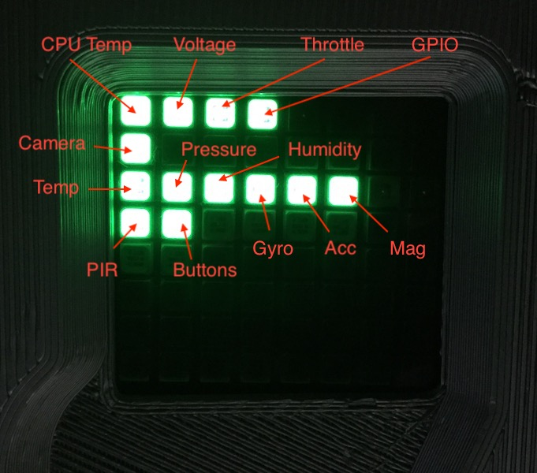

# Self Test

## Setup

```sh
sudo apt install sense-hat

pip3 install logzero
pip3 install picamera
```

## Usage

```sh
cd selftest
python3 selftest.py --timeout 20
```

Once the program has finished, the overall status will be displayed on the LED matrix.

- A green pixel indicates that the test was successful.

- A teal pixel shows that an interactive test was not successfully completed before the specified timeout period expired.

- A red pixel is used to identify a test which failed.



## References

- [Astro Pi - Test the hardware](https://projects.raspberrypi.org/en/projects/astro-pi-flight-case-mk2/10)
